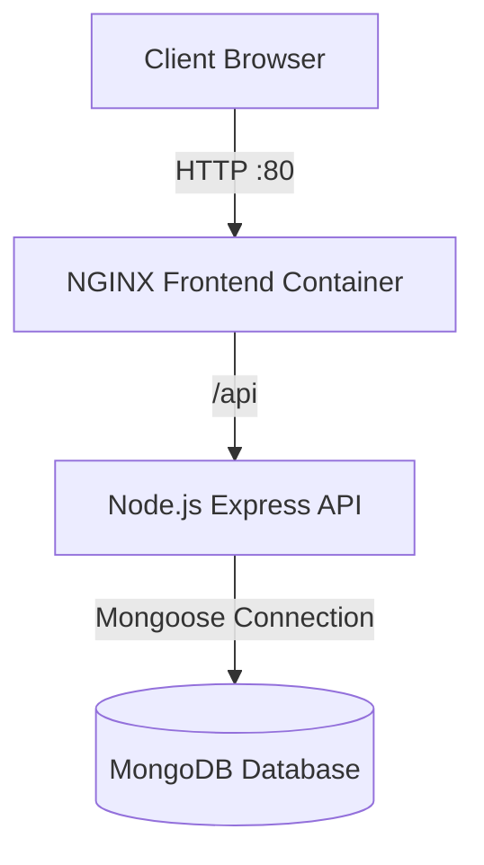
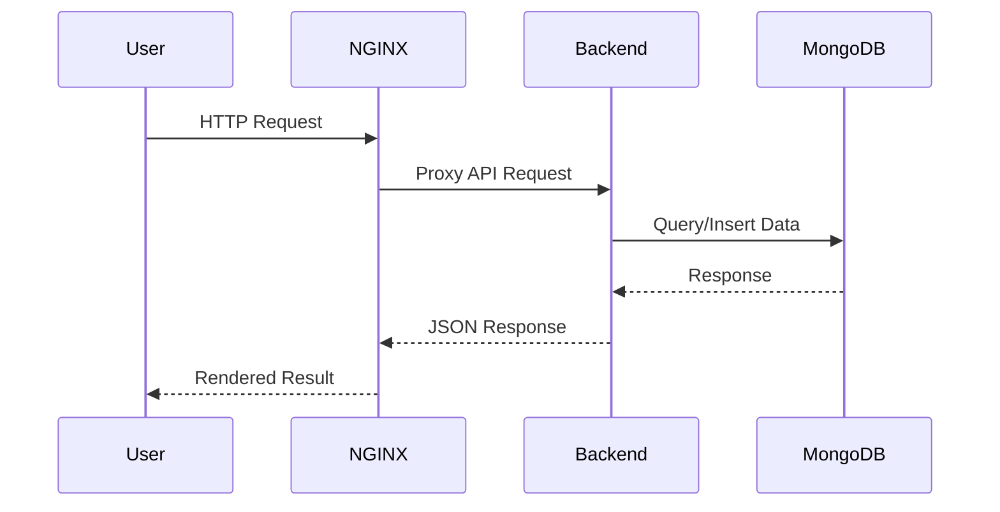
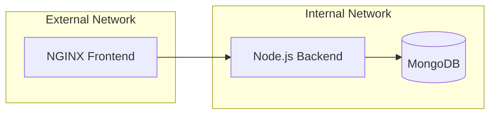
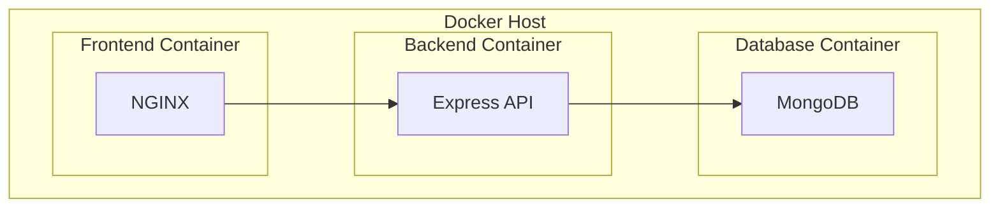

# Docker Compose 3-Tier Architecture

A production-style 3-tier application architecture built with Docker Compose using:

- NGINX as Reverse Proxy and Frontend Web Server
- Node.js + Express as Backend API
- MongoDB as Database Layer

The project demonstrates containerized application deployment, internal networking, reverse proxy configuration, and persistent storage using Docker volumes.

---

# Architecture Overview



---

# Project Structure

```text
saifomran-compose-3tier-architecture/
├── README.md
├── docker-compose.yml
├── .dockerignore
├── backend/
│   ├── Dockerfile
│   ├── package.json
│   └── src/
│       └── index.js
├── frontend/
│   ├── Dockerfile
│   └── index.html
└── nginx/
    └── default.conf
```

---

# Technology Stack

| Layer | Technology |
|---|---|
| Frontend | HTML, Bootstrap, NGINX |
| Backend | Node.js, Express.js |
| Database | MongoDB |
| Containerization | Docker |
| Orchestration | Docker Compose |

---

# Application Workflow



---

# Network Design

The application uses two Docker networks:

| Network | Purpose |
|---|---|
| external | Exposes frontend to users |
| internal | Secure communication between backend and database |



---

# Features

## Frontend

- Responsive Employee Management Dashboard
- Bootstrap-based UI
- Employee CRUD Interface
- Dynamic Filtering
- API Integration through Reverse Proxy

## Backend

- RESTful API with Express.js
- MongoDB Integration using Mongoose
- CRUD Operations
- Filtering by:
  - Department
  - Salary Range
  - Skill
  - Active Status
- Database Seeding Endpoint

## Database

- Persistent MongoDB Volume
- Internal Network Isolation
- Environment Variable Configuration

---

# Docker Compose Services

## Frontend Service

- Built from custom NGINX image
- Exposes port `80`
- Connected to both internal and external networks

## Backend Service

- Node.js API container
- Internal communication only
- Loads environment variables from `.env`

## MongoDB Service

- Official MongoDB image
- Persistent volume storage
- Internal-only access

---

# Container Architecture



---

# Environment Variables

Create a `.env` file in the project root:

```env
DB_USER=${DB_USER}
DB_PASSWORD=${DB_PASSWORD}
DB_HOST=mongo
DB_PORT=27017
DB_NAME=<DB_NAME>

```

---

# Getting Started

## Clone Repository

```bash
git clone https://github.com/<your-username>/<repo-name>.git
cd saifomran-compose-3tier-architecture
```

---

## Build and Run Containers

```bash
docker compose up --build
```

Run in detached mode:

```bash
docker compose up -d --build
```

---

# Verify Running Containers

```bash
docker ps
```

Expected containers:

- front
- web
- database

---

# Access Application

| Service | URL |
|---|---|
| Frontend | http://localhost |
| Backend API | http://localhost/api |
| MongoDB | Internal Only |

---

# API Endpoints

## General

| Method | Endpoint | Description |
|---|---|---|
| GET | `/api/users` | Get all users |
| POST | `/api/users` | Create user |
| GET | `/api/users/:id` | Get user by ID |
| PUT | `/api/users/:id` | Update user |
| DELETE | `/api/users/:id` | Delete user |

---

## Filtering

| Method | Endpoint | Description |
|---|---|---|
| GET | `/api/department/:dept` | Filter by department |
| GET | `/api/salary/:min/:max` | Filter by salary range |
| GET | `/api/skill/:skill` | Filter by skill |
| GET | `/api/active/all` | Get active users |

---

## Seed Database

```http
POST /api/seed
```

This endpoint clears existing data and inserts sample employees.

---

# Reverse Proxy Configuration

NGINX forwards API traffic using:

```nginx
location /api/ {
    proxy_pass http://node-app:4000/;
}
```

This allows the frontend and backend to share the same public endpoint.

---

# Security Considerations

- MongoDB is isolated inside the internal Docker network
- Backend service is not publicly exposed
- Environment variables are externalized
- Persistent data stored using Docker volumes

---

# Persistent Storage

MongoDB data persists using Docker volumes:

```yaml
volumes:
  mongo-db:
```

This prevents data loss after container restarts.

---

# Development Commands

## Stop Containers

```bash
docker compose down
```

## Stop Containers and Remove Volumes

```bash
docker compose down -v
```

## View Logs

```bash
docker compose logs -f
```

## Rebuild Services

```bash
docker compose up --build
```

---

# Future Improvements

- JWT Authentication
- Role-Based Access Control
- HTTPS with SSL Certificates
- CI/CD Integration
- Kubernetes Deployment
- Monitoring with Prometheus and Grafana
- Multi-stage Docker Builds
- Health Checks
- API Documentation with Swagger

---

# Learning Objectives

This project demonstrates:

- Docker Compose orchestration
- Multi-container architecture
- Reverse proxy configuration
- Internal container networking
- MongoDB persistence
- Backend API development
- Environment variable management
- NGINX configuration
- Service isolation

---
